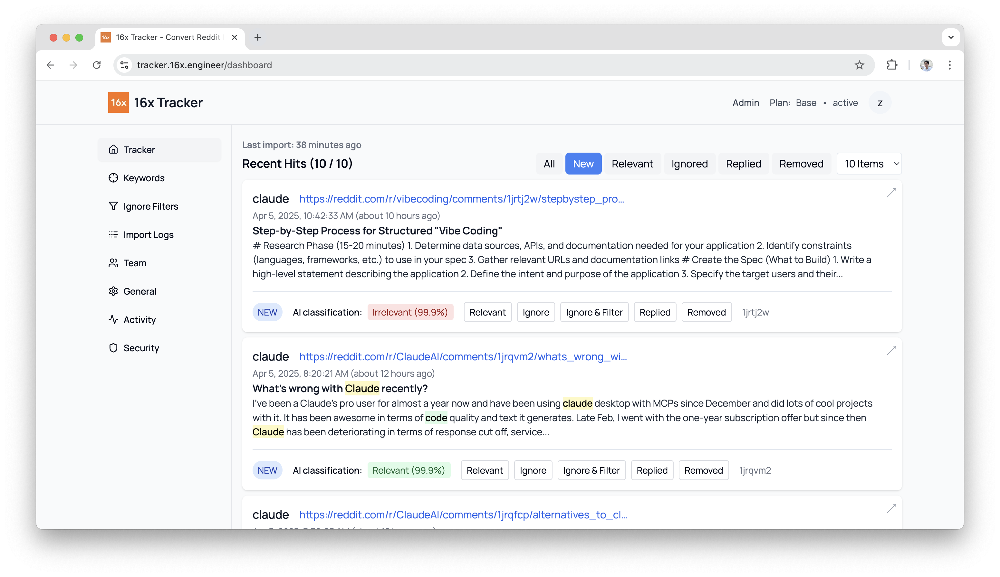

# Reddit Post Classifier

This project is a simple classifier for Reddit posts. It uses pre-trained models to classify posts as relevant or irrelevant.

Created by [16x Tracker](https://tracker.16x.engineer/)



## System Requirements

- Minimum 2GB RAM (4GB recommended)
- Docker and Docker Compose installed
- About 1GB disk space for the models and dependencies

## Sample Results

### Apr 5 run

Pre-processing

```
Total entries processed: 9353
Unique entries: 4549
Duplicate entries: 1191
F5Bot filtered entries: 8
Team ID filtered entries (not team 1): 10359

Status breakdown:
RELEVANT/REPLIED: 241
IGNORED: 4246
NEW: 3
CONTENT_REMOVED: 59
```

Model Results

```
               precision    recall  f1-score   support

           0       0.98      0.95      0.96      1437
           1       0.25      0.50      0.33        50

    accuracy                           0.93      1487
   macro avg       0.62      0.72      0.65      1487
weighted avg       0.96      0.93      0.94      1487
```

### Apr 18 run

Pre-processing

```
Total entries processed: 8473
Unique entries: 4258
Duplicate entries: 1174
F5Bot filtered entries: 8
Team ID filtered entries (not team 1): 0

Status breakdown:
RELEVANT/REPLIED: 274
IGNORED: 3828
NEW: 86
CONTENT_REMOVED: 70
```

Model Results

```
              precision    recall  f1-score   support

           0       0.97      0.94      0.95       766
           1       0.40      0.53      0.46        55

    accuracy                           0.92       821
   macro avg       0.68      0.74      0.71       821
weighted avg       0.93      0.92      0.92       821
```

### Apr 19 run

Pre-processing

```
Total entries processed: 8288
Unique entries: 4076
Duplicate entries: 1171
F5Bot filtered entries: 0
Team ID filtered entries (not team 1): 0
Timestamp filtered entries (older than 90 days): 193

Status breakdown:
RELEVANT/REPLIED: 123
IGNORED: 3828
NEW: 86
CONTENT_REMOVED: 39
```

Model Results

distilbert-base-uncased

```
              precision    recall  f1-score   support

           0       0.97      0.98      0.97       766
           1       0.05      0.04      0.05        25

    accuracy                           0.95       791
   macro avg       0.51      0.51      0.51       791
weighted avg       0.94      0.95      0.94       791
```

roberta-base

```
              precision    recall  f1-score   support

           0       0.97      0.98      0.98       766
           1       0.22      0.16      0.19        25

    accuracy                           0.96       791
   macro avg       0.60      0.57      0.58       791
weighted avg       0.95      0.96      0.95       791
```

### Regressor Model

The regressor model is a simple linear regression model that uses the pre-trained roberta-base model to predict the relevance score of a post.

```
Regressor Test Results Summary:
Total samples tested: 60
Overall accuracy: 80.00%
Irrelevant samples accuracy: 73.33% (22/30)
Relevant samples accuracy: 86.67% (26/30)

Classification Metrics:
Precision: 0.7647
Recall: 0.8667
F1 Score: 0.8125

Regression Metrics:
Mean Squared Error (MSE): 0.4112
R-squared (R²): -0.6447

Confusion Matrix:
True Positives: 26
False Positives: 8
True Negatives: 22
False Negatives: 4
```

### URL Regressor Model

The URL regressor model is a simple linear regression model that uses the pre-trained roberta-base model to predict the relevance score of a post. URL is added as prefix to the post content. The data used is from April 2025.

Model weights: `best_url_regressor_run1_epoch_5.pt`
Optimal threshold: 0.1500

URL prefix logic sample:

```py
output_path = 'sample_url_prefix.txt'
url = 'https://www.google.com'
content = 'This is a test post'

with open(output_path, 'w', encoding='utf-8') as f:
   if url:
      f.write(f"{url}\n\n")
   f.write(content)
```

Results:

```
================================================================================
REGRESSOR MODEL TEST RESULTS - 2025-05-10 16:37:48
================================================================================

Optimal threshold: 0.1500

================================================================================
TESTING 30 RANDOM IRRELEVANT SAMPLES
================================================================================

================================================================================
SUMMARY
================================================================================

Total samples tested: 60
Overall accuracy: 81.67%
Irrelevant samples accuracy: 73.33% (22/30)
Relevant samples accuracy: 90.00% (27/30)

Classification Metrics:
Precision: 0.7714
Recall: 0.9000
F1 Score: 0.8308

Regression Metrics:
Mean Squared Error (MSE): 0.2690
R-squared (R²): -0.0762

Confusion Matrix:
True Positives: 27
False Positives: 8
True Negatives: 22
False Negatives: 3
```

## Running the API Server

### Using Docker Compose (Recommended)

The easiest way to run the service is using Docker Compose. The service will run in a container named `reddit-classifier-api`:

```bash
# pull latest changes from repo, rebuild the image and start the service
git pull && docker compose up --build -d

# view logs
docker compose logs -f

# Stop the service
docker compose down

# view container logs directly (using container name)
docker logs -f reddit-classifier-api
```

### Using Docker

Build the Docker image:

```bash
docker build -t reddit-post-classifier .
```

Run the container:

```bash
docker run -p 9092:9092 reddit-post-classifier
```

### Without Docker

Run the API server directly:

```bash
python api-server.py
```

## API Documentation

See [API_DOC.md](API_DOC.md) for more details.
